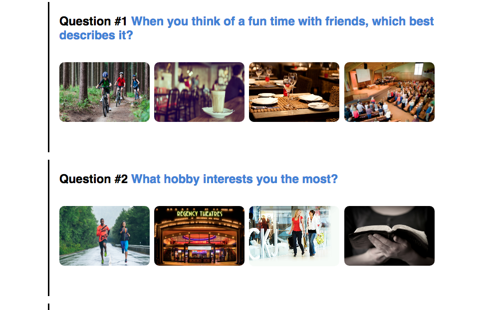
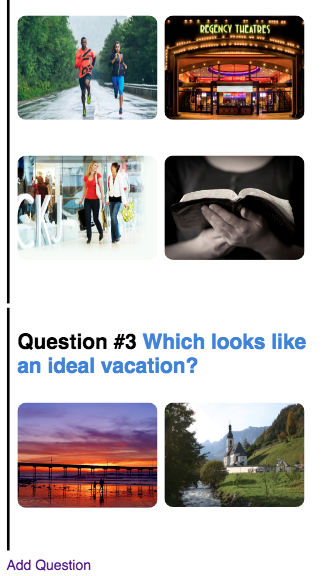
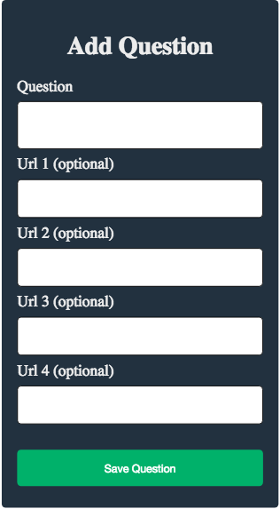
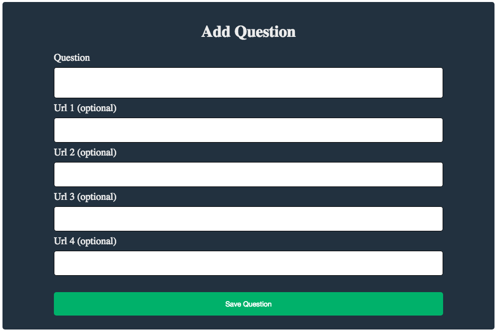

# QuizApp

A proof of concept quiz app. Made using the CakePHP framework.

1. Install an *AMP server. This is a free, self-contained local hosting environment that packages up an Apache web server, MySQL database and PHP in a single downloadable package.You can get it here: http://ampps.com/

	- **Download and installed from [AMPPS download page](http://www.ampps.com/downloads)**.

	- **Mac OSX Apache already running on port 80. Changed listen port to 8888 (in httpd.conf)**.

	- **Changed \<Directory> apache permission in httpd.conf file from _Deny from all_ to _Allow from all_**.

	- **localhost:8888 now accessible from webroot in app**. 

2. Download and configure the CakePHP framework ([version 1.3 here](https://api.cakephp.org/1.3/)). This is a model-view-controller (MVC) framework we use for backend development, similar to Ruby on Rails or Django for Python.

	- **git clone into master @ https://github.com/cakephp/cakephp.git**

	- **git checkout 1.3.0**
	
3. Follow the example of creating a simple blog from the Cake Cook Book, found here. Alter the code from the example so instead of creating a blog post, you create a single page visual quiz, which collects a question and 4 image options via URLs (see attached). Then upon saving the selections, it'd display it in the browser. It doesn't need to be interactive, instead it can just output the question results as a proof of concept. I've attached a simple example of adding a question with image URLs as options and then displaying all the questions on a page. You can style it if you want, but if you're not familiar with CSS feel free to leave default styles.

	- **Followed CakePHP blog example**.

	- **Based on CakePHP blog example, created a basic proof of concept quiz app**.

+ **Basic Features**

	+ **One row of images for view ports over 800px. Two rows of images for smaller than 800px viewport**.

	+ **Add images via _Add Question_ button. Image URLs are optional**.

---

## Demo Images

Quiz with a wide viewport.

Quiz with a narrow viewport. Scrolled to bottom with add question link. Example of only using two (of the four url options) images for a question.

Add page with narrow viewport.

Add page with wide viewport.

